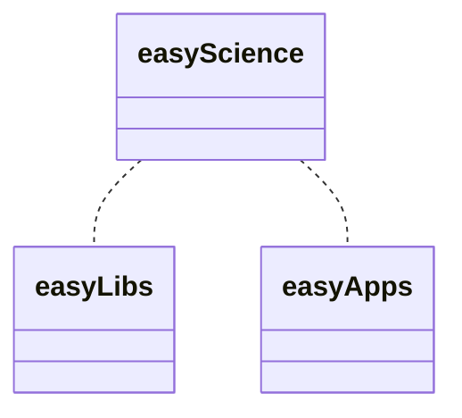
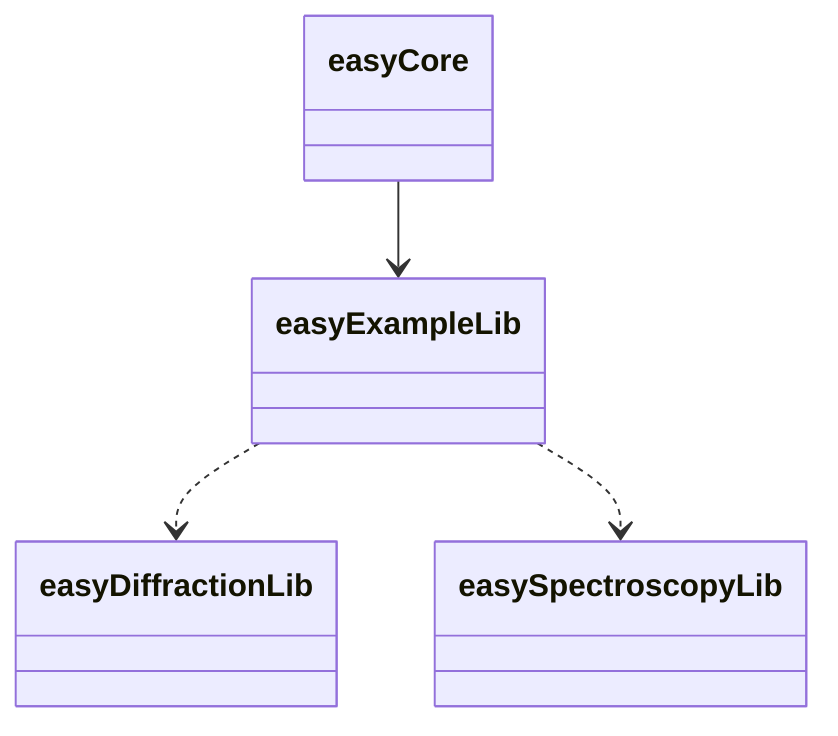
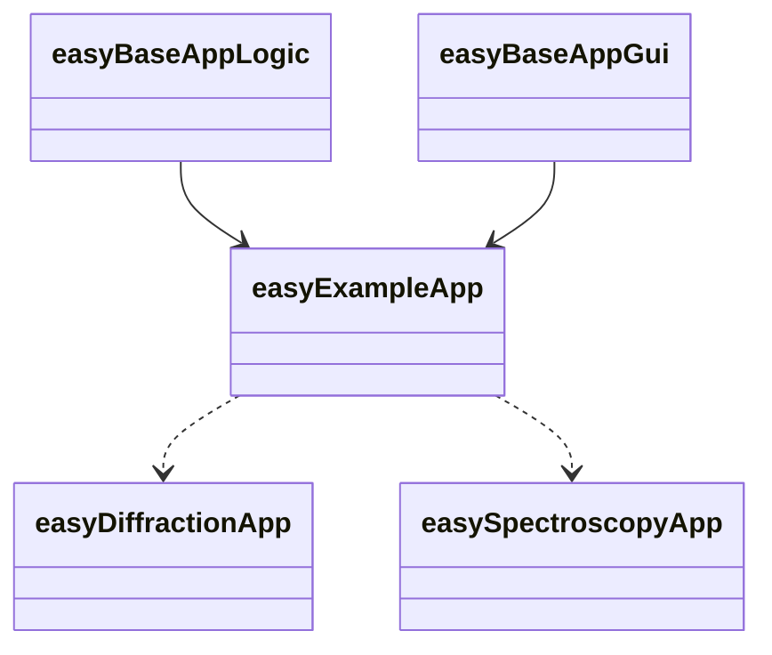
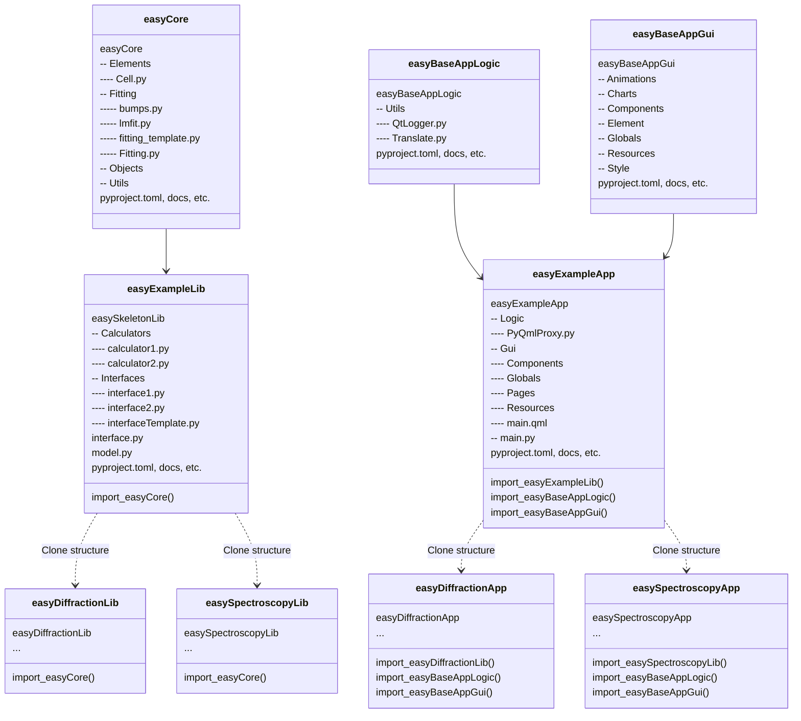
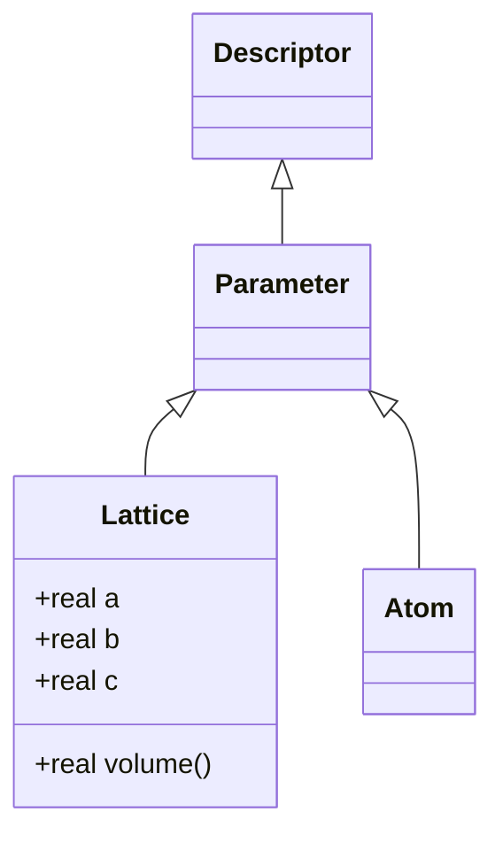

# Diagrams

Mermaid-based easyScience project diagrams.

- About Mermaid: https://mermaid-js.github.io/mermaid
- Flow charts: https://mermaid-js.github.io/mermaid/#/flowchart
- Class diagrams: https://mermaid-js.github.io/mermaid/#/classDiagram
- Live editor: https://mermaidjs.github.io/mermaid-live-editor
- Chrome extension: https://chrome.google.com/webstore/detail/mermaid-diagrams/phfcghedmopjadpojhmmaffjmfiakfil
- Atom package: https://atom.io/packages/atom-mermaid

## Project structure

### easyScience

[Kroki-based](https://kroki.io/) image

### easyLibs

[Kroki-based](https://kroki.io/) image

### easyApps

[Kroki-based](https://kroki.io/) image

### Repo structure

[Kroki-based](https://kroki.io/) image

## Class diagrams

#### easyCore.Objects.Base

[Kroki-based](https://kroki.io/) image

