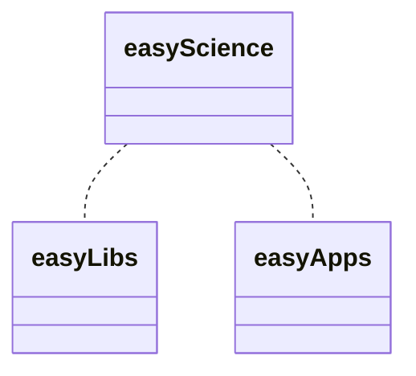
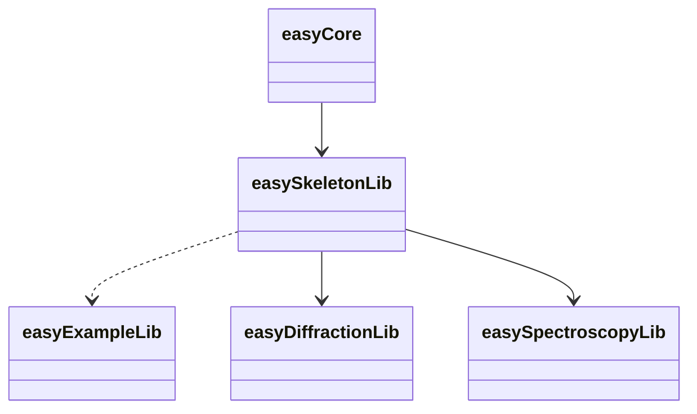
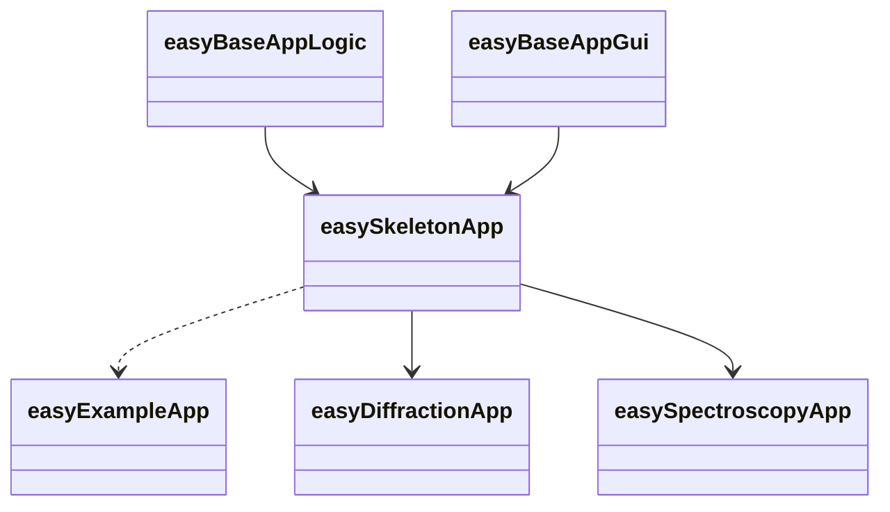
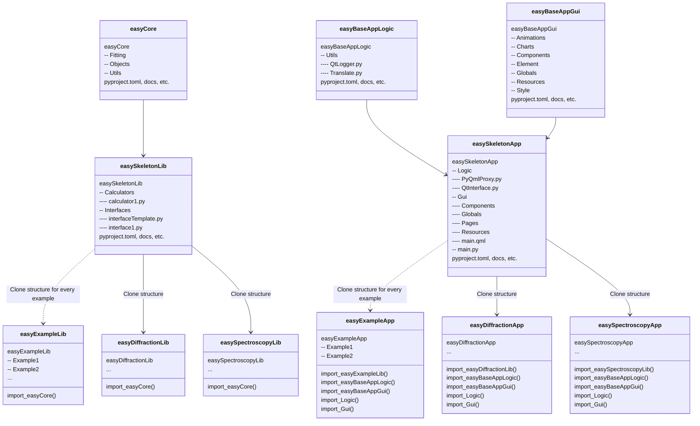
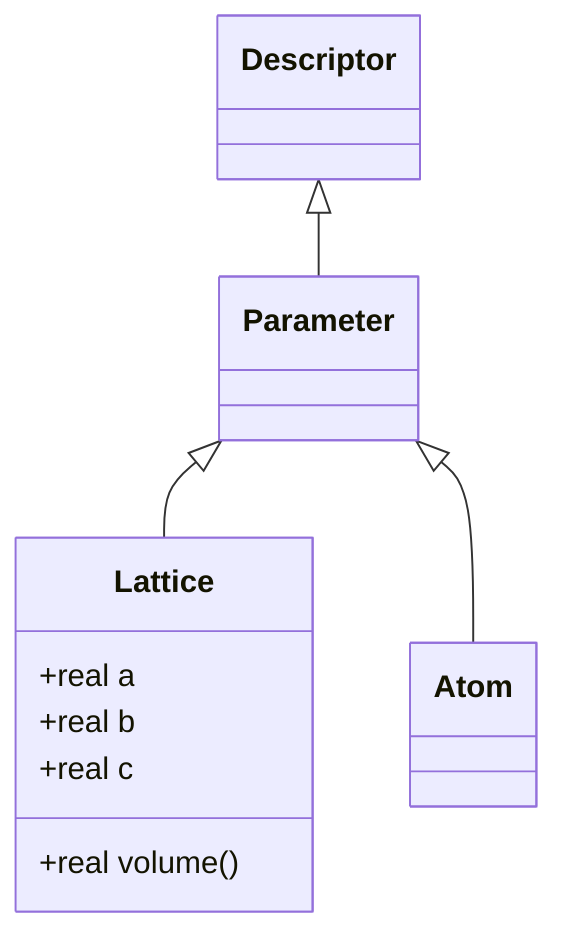

# Diagrams

Mermaid-based easyScience project diagrams.

-   About Mermaid: <https://mermaid-js.github.io/mermaid>
-   Flow charts: <https://mermaid-js.github.io/mermaid/#/flowchart>
-   Class diagrams: <https://mermaid-js.github.io/mermaid/#/classDiagram>
-   Live editor: <https://mermaidjs.github.io/mermaid-live-editor>
-   Chrome extension: <https://chrome.google.com/webstore/detail/mermaid-diagrams/phfcghedmopjadpojhmmaffjmfiakfil>

## Project structure

### easyScience

### easyLibs

### easyApps

### Repo structure

[Kroki-based](https://kroki.io/) diagram

## Class diagrams

#### easyCore.Objects.Base

