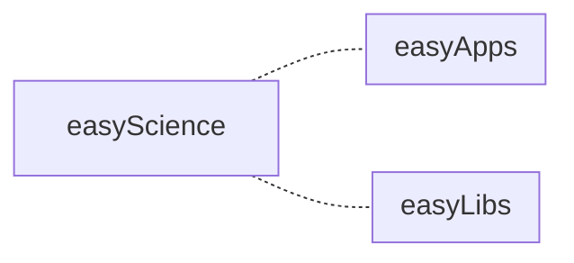
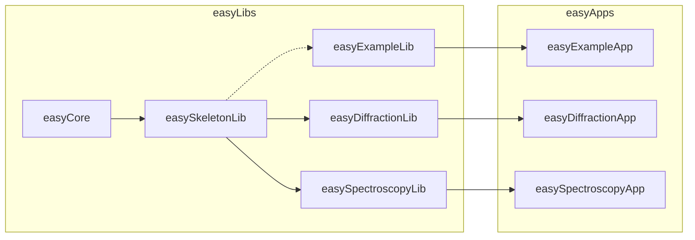
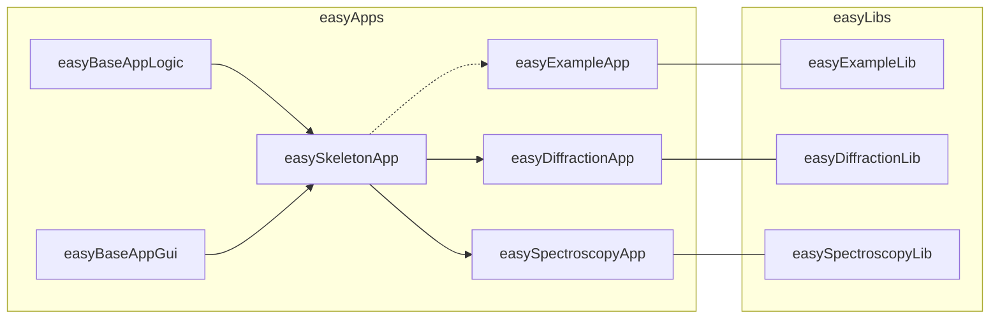
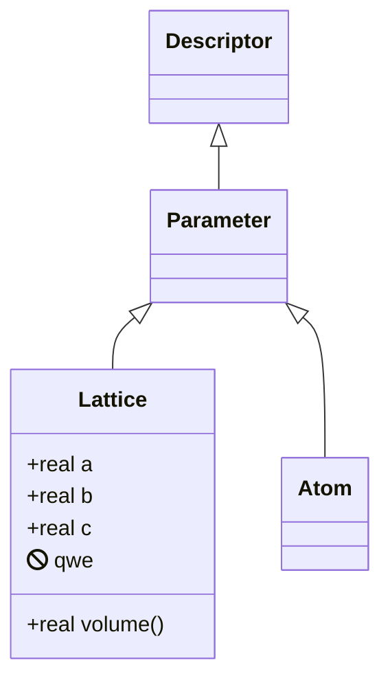

# Diagrams

Mermaid-based easyScience project diagrams.

* About Mermaid: https://mermaid-js.github.io/mermaid
* Flow charts: https://mermaid-js.github.io/mermaid/#/flowchart
* Class diagrams: https://mermaid-js.github.io/mermaid/#/classDiagram
* Live editor: https://mermaidjs.github.io/mermaid-live-editor

## Project structure

### easyScience



### easyLibs



### easyApps



## Repo structure

### easyApps

```mermaid
classDiagram

class easyBaseAppLogic {
├── easyBaseAppLogic
│⠀  ├── Utils
│⠀  ├── QtLogger.py
│⠀  └── Translate.py
└── pyproject.toml, docs, etc.
}

class easyBaseAppGui {
├── easyBaseAppGui
│⠀  ├── Animations
│⠀  ├── Charts
│⠀  ├── Components
│⠀  ├── Element
│⠀  ├── Globals
│⠀  ├── Resources
│⠀  └── Style
└── pyproject.toml, docs, etc.
}

classDiagram

class easyBaseAppLogic {
├── easyBaseAppLogic
│⠀  ├── Utils
│⠀  ├── QtLogger.py
│⠀  └── Translate.py
└── pyproject.toml, docs, etc.
}

class easyBaseAppGui {
├── easyBaseAppGui
│⠀  ├── Animations
│⠀  ├── Charts
│⠀  ├── Components
│⠀  ├── Element
│⠀  ├── Globals
│⠀  ├── Resources
│⠀  └── Style
└── pyproject.toml, docs, etc.
}

class easySkeletonApp {
├── easySkeletonApp
│└── Logic
│ └── Logic
│  └── Logic
│   └── Logic
│    └── Logic
│     └── Logic
│      └── Logic
│       └── Logic
}

```

## Class diagrams


