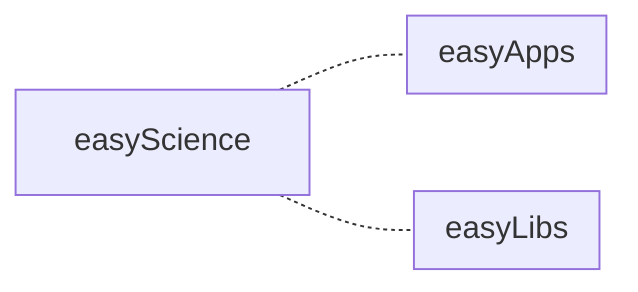
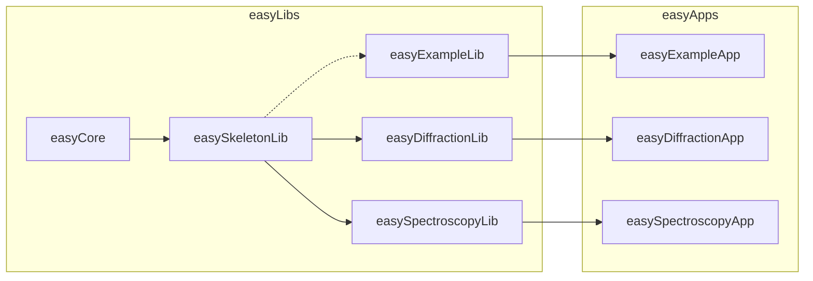
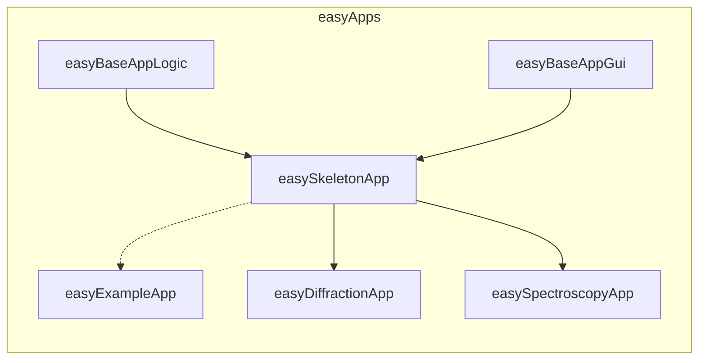
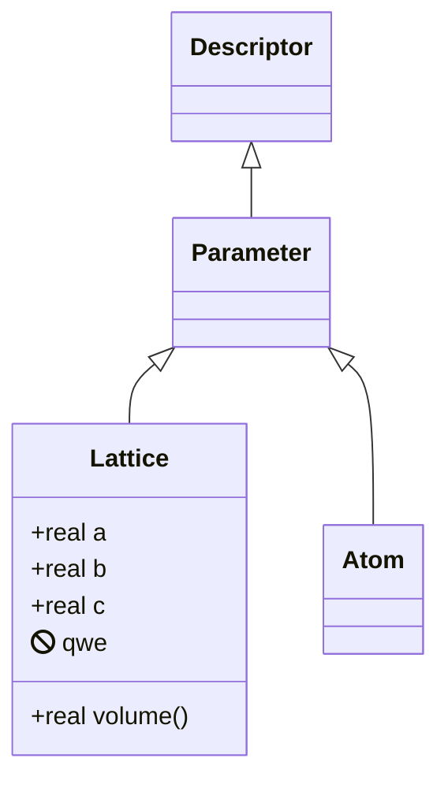

# Diagrams

Mermaid-based easyScience project diagrams.

* About Mermaid: https://mermaid-js.github.io/mermaid
* Live editor: https://mermaidjs.github.io/mermaid-live-editor

## Flow charts

Manual: https://mermaid-js.github.io/mermaid/#/flowchart

### easyScience

### easyLibs

### easyApps

## Class diagrams

Manual: https://mermaid-js.github.io/mermaid/#/classDiagram

