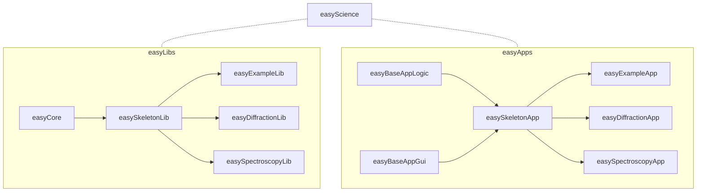
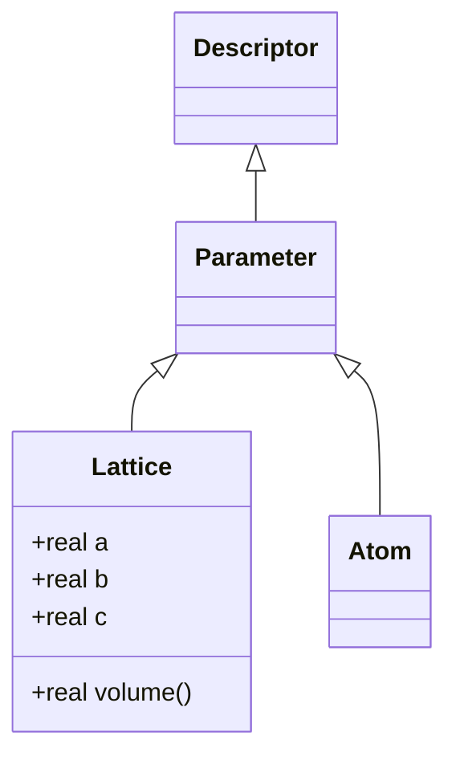

# Diagrams

## Flow charts

```mermaid
flowchart TD 

	easyScience -.- easyLibs
	easyScience -.- easyApps

	subgraph easyLibs
	
	easyCore --> easySkeletonLib

	easySkeletonLib --> easyExampleLib
	easySkeletonLib --> easyDiffractionLib
	easySkeletonLib --> easySpectroscopyLib

	end

	subgraph easyApps

	easyBaseAppLogic --> easySkeletonApp
	easyBaseAppGui --> easySkeletonApp

	easySkeletonApp --> easyExampleApp
	easySkeletonApp --> easyDiffractionApp
	easySkeletonApp --> easySpectroscopyApp

	end
```

## Class diagrams

**Example 0**

```mermaid
classDiagram

	Descriptor <|-- Parameter
	Parameter <|-- Lattice
	Parameter <|-- Atom

	class Descriptor {
	}

	class Parameter {
	}

	class Lattice {
		+real a
		+real b
		+real c
		+real volume()
	}

	class Atom {
	}
```

# Info

* About Mermaid: https://mermaid-js.github.io/mermaid
* Live editor: https://mermaidjs.github.io/mermaid-live-editor
