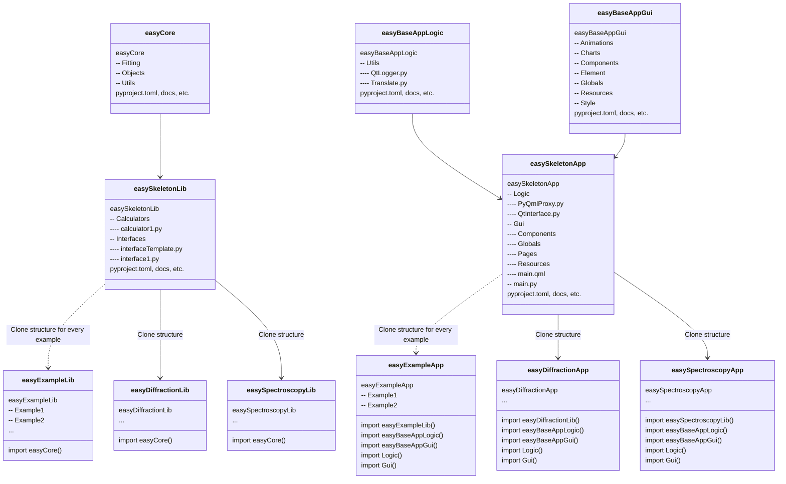

# Diagrams

Mermaid-based easyScience project diagrams.

* About Mermaid: https://mermaid-js.github.io/mermaid
* Flow charts: https://mermaid-js.github.io/mermaid/#/flowchart
* Class diagrams: https://mermaid-js.github.io/mermaid/#/classDiagram
* Live editor: https://mermaidjs.github.io/mermaid-live-editor

## Project structure

### easyScience

### easyLibs

### easyApps

## Repo structure

### easyScience (small)

### easyScience (medium)

## Class diagrams

